# Doppio — Claude Credit Budget

Tracking Claude API credit balance throughout the hackathon build (March 6–8, 2026).

---

### March 6, 2026 at 2:20 PM (Session Start)

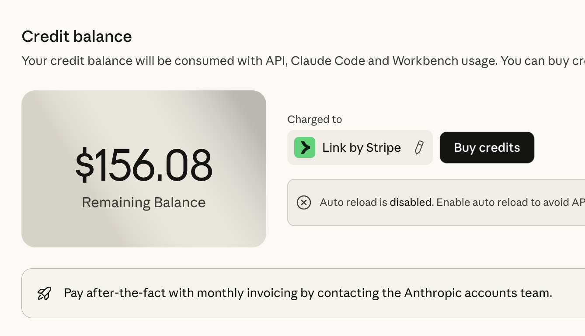

---

### March 6, 2026 at 3:56 PM

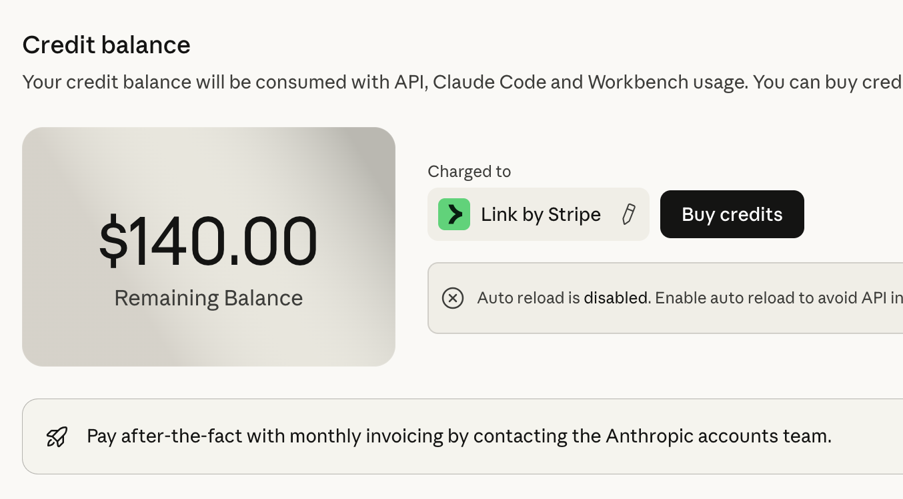

---

### March 6, 2026 at 5:24 PM

**Balance:** $123.44

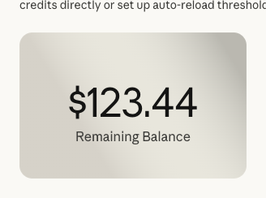

---

### March 6, 2026 at 6:00 PM

**Balance:** unknown

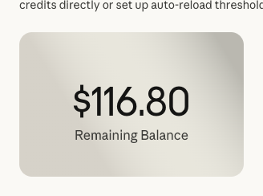

---

### March 6, 2026 at 7:00 PM

**Balance:** $101.46

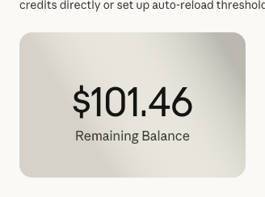

---

### March 6, 2026 at 8:00 PM

**Balance:** $90.03

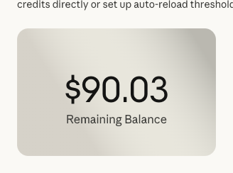

---

### March 6, 2026 at 9:00 PM

**Balance:** $85.18

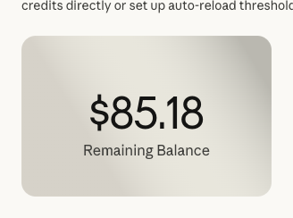

---

### March 6, 2026 at 9:59 PM

**Balance:** $77.86

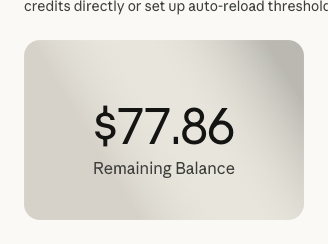

---

### March 6, 2026 at 10:00 PM

**Balance:** $77.81

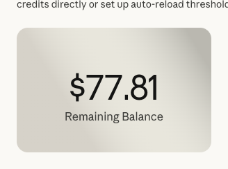

---

### March 6, 2026 at 11:00 PM

**Balance:** $72.26

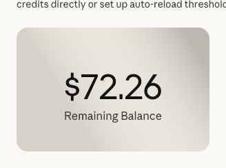

---

### March 7, 2026 at 12:00 AM

**Balance:** $61.72

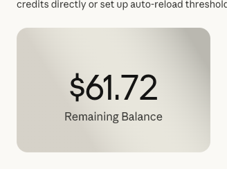
